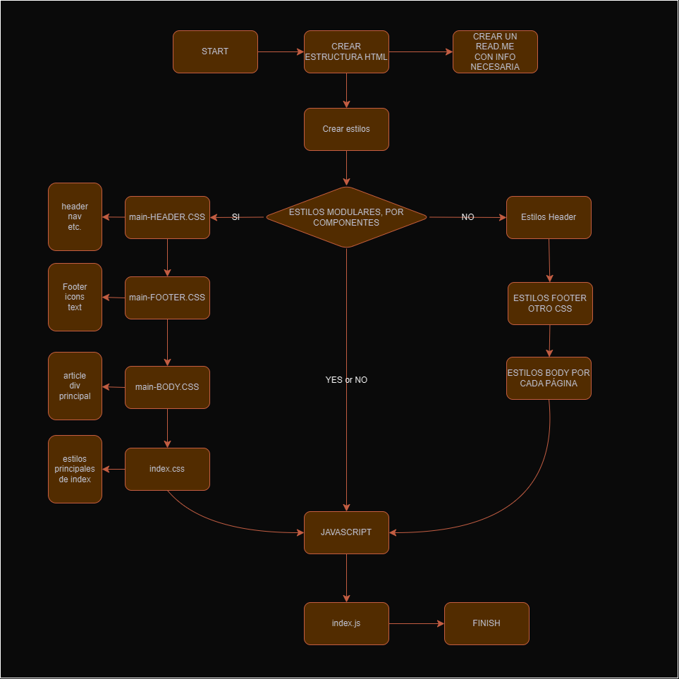

_Texto especial para el repositorio de Github...._

# THE BACKDOOR

THE BACKDOOR es un prototipo en diseño de blog que he estado planificando y maquetando.
En una actividad reciente nos pidieron que elaboremos una web con HTML y CSS en la cuál mostremos qué es y cómo funciona alguna herramienta de Ciberseguridad de nuestra elección.   
Por nuestra parte escogimos la herramienta de búsqueda de hosts SHODAN.io  
A continuación mostraré más información acerca de esta herramienta y cómo fue la planificación de la web.

## Proceso de creación

Primero realizamos un diseño de cómo queríamos que se vea la web en:   
[Web Diseño PDF](webdiseno.pdf)    

Entonces decidimos realizar un flujo de trabajo con el cuál poder .

### Herramientas usadas en el proyecto
Para este proyecto nos ayudamos de las siguientes herramientas:

* __Figma:__ Herramienta para diseñar la web.
* __dafont.com:__ Lugar donde descargué las fuentes personalizadas del proyecto.
* __VSCode:__ Herramienta con la cuál fue programado todo el proyecto.
* __Chat GPT:__ Herramienta que ayudó a sintetizar la web.
* __svgrepo.com:__ Repositorio de Íconos SVG gratuitos.
* __Canva:__ Aquí se creó el ícono de la web.

